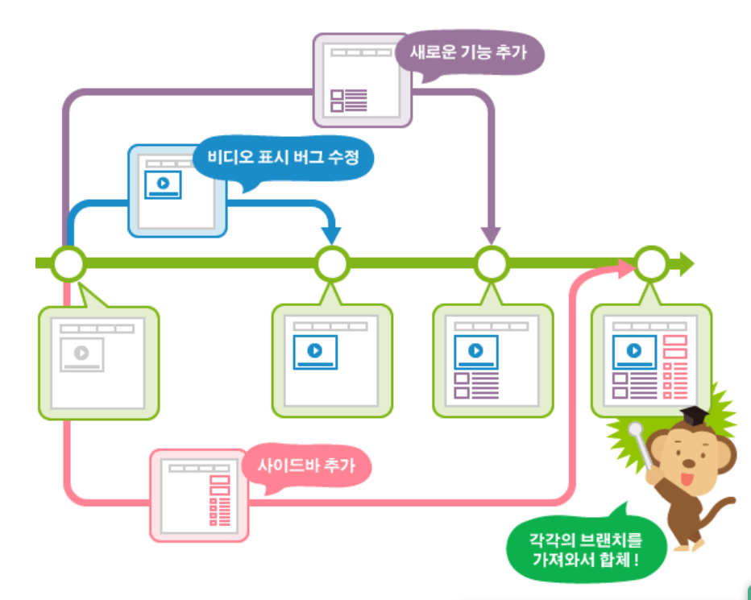
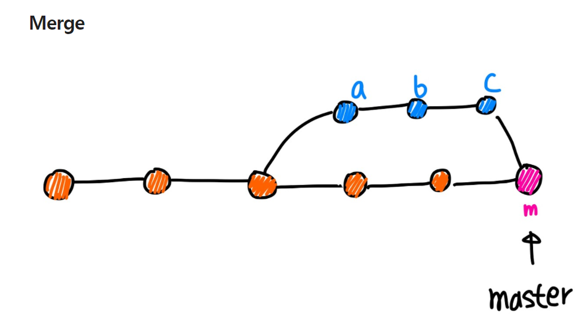
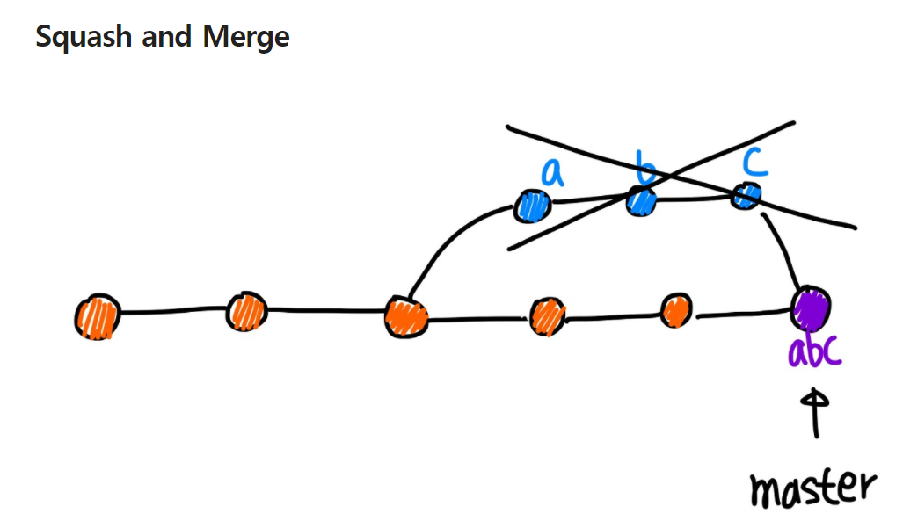
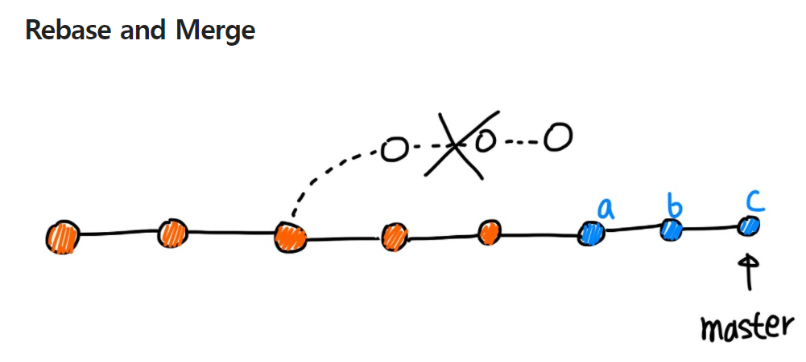

# git 발전편!

## branch
- 독립적으로 어떤 작업을 진행하기 위한 개념
- 여러 사람이 동시에 작업을 진행할 때 다른 버전의 코드가 만들어 지기 때문에 각자의 환경에서 작업할 수 있도록 해주는 기능
- 만들어진 branch는 다른 branch와 병합(merge)함으로써, 작업한 내용을 다시 새로운 하나의 브랜치로 모을 수 있다.  

- master 브랜치 : 최상단 브랜치. 저장소를 처음 만들면 생기는 브랜치로 새로운 저장소에서 하는 모든 작업(커밋, 푸쉬 등등)이 master 브랜치에서 이루어진다.
- 새로운 브랜치로 넘어가기 위해선 해당 브랜치 생성 후 checkout으로 넘어가야 한다.
- 통합 브랜치 : 언제든지 배포할 수 있는 버전을 만들 수 있어야 하는 브랜치 ex) master
- 토픽 브랜치 : 기능 추가나 버그 수정과 같은 단위 작업을 위한 브랜치 ex) jkh...

## HEAD
- 현재 사용 중인 브랜치의 선두 부분을 나타내는 이름
- 커밋을 지정할 때, '~'와 '^'을 사용하여 현재 커밋으로 부터 특정 커밋의 위치를 가르킬 수 있다.
- ex) HEAD~3 : 기존 HEAD로 부터 3세대 이전 내용
- ex) HEAD^1 : 브랜치 병합시 첫번째 원본

## stash
- 파일의 변경 내용을 일시적으로 기록해두는 영역
- 커밋하지 않은 변경 내용이나 새롭게 추가한 파일이 인덱스와 작업 트리에 남아 잇는 채로 다른 브랜치로 전환되면, 그 변경 내용은 기존 브랜치가 아닌 전환된 브랜치에서 커밋할 수 있다.
- 단, 커밋 가능한 변경 내용 중에 전환된 브랜치에서도 한 차례 변경이 되어 있는 경우에는 전환이 안됨
- 이 경우 이전 브랜치에서 커밋하지 않은 변경 내용을 커밋하거나, stash를 이용해 일시적으로 변경 내용을 다른 곳에 저장하여 충돌을 피하게 한 뒤 전환해야함.

## merge
- 브랜치를 통합하는 방법 중 하나
- fast-forward : master에서 다른 브랜치가 분기한 이후 master 브랜치에 변경 사항이 없는 경우 빠르게 merge 가능한 경우를 뜻함 (즉 분기 브랜치 자체가 통합 브랜치가 되는 느낌)
- non fast-forward : fast-forward의 경우 분기한 브랜치가 직접 master가 되는 느낌이면 non fast-forward는 토픽 브랜치는 따로 남아 있고 변경 이력만 통합 브랜치로 합쳐진 경우를 뜻함
- merge commit : 다른 브랜치가 분기된 이후 각각 변경 이력이 생긴 경우 양쪽의 변경 사항을 합쳐주는 것을 뜻함

## rebase
- merge와는 다른 브랜치 통합법 중 하나
- 이어붙이기 느낌. rebase를 하면 분기된 브랜치의 변경 이력이 master브랜치 뒤로 붙게 되며 하나의 줄기로 이어짐
- 이때 발생하는 충돌에 대해선 수정이 필요
- 수정이 완료되면 fast-forward를 통해 master를 앞당겨 줘야함

## merge & rebase
- 둘다 브랜치를 통합하지만 목적이 다름
- merge : 변경 내용의 이력이 모두 그대로 남아 있기 때문에 이력이 복잡해짐. 통합 브랜치에서 토픽 브랜치를 불러올 경우에는 우선 rebase를 한 후 merge
- rebase : 이력은 단순해지지만, 원래의 커밋 이력이 변경됨. 정확한 이력을 남겨야 할 필요가 있을 경우에는 사용하면 안됨. 토픽 브랜치에서 통합 브랜치의 최신 코드를 적용할 경우에는 rebase

## branch 만들기
$ git branch <이름> (생성)
$ git checkout <이름> (이동) (tip! git checkout -b <이름> 을 진행하면 생성과 이동을 동시에 할 수 있다.)
text.txt 파일 수정중
$ git add text.txt (파일추가 - 아마 stash)
$ git commit -m "추가하기" (커밋 -> 이력 생성)

## branch 병합하기
1. HEAD를 master로 옮기기 (git checkout master)
2. 병합하기 (git merge <branch명>) -> 이때 master는 변경 이력이 존재하면 안된다.(fast-forward)

## branch 삭제하기
- git branch -d <branch명>

## branch 여러 분기를 병합하기
- master 브랜치로부터 분기가 여러개 되어 각자의 작업을 마친 브랜치를 합치기 위한 방법 - merge는 무조건 master에서!
- $ git branch B1
- $ git branch B2
- $ git checkout B1
- 수정
- $ git add 수정내역
- $ git commit -m 'B1수정'
- $ git checkout B2
- 수정
- $ git add 수정내역
- $ git commit -m 'B2수정'

### merge로 통합
1. git checkout master
2. git merge B1 (merge완료)
3. git merge B2 (충돌 발생)
4. 충돌 내역 확인 후 적절히 수정
5. git add 충돌 수정 내역
6. git commit -m "B2 브랜치 병합"
- 이와 같은 방법은 충돌 수정 내역 또한 commit으로 남게 되고 병합 커밋 또한 완성되었다. 이와 같은 방식을 non fast-forward라고 한다.

### rebase로 통합
1. git checkout master
2. git merge B1 (merge 완료)
3. git checkout B2(rebase할 브랜치로 이동)
4. git rebase master(마스터로 rebase할 것을 요청 -> 충돌 발생)
5. 충돌 내역 적절히 수정
6. git add 수정 내역
7. git rebase --continue (rebase 마저 진행)
- 이와 같은 방법으로 진행하면 분기된 B2는 master 뒤로 붙게 된다.
8. git checkout master
9. git merge B2
- 이후 master로 이동한 후 merge를 진행하면 통합이 완료된다. 위의 merge방법과는 다르게 이때는 B2의 이력이 남지 않게 된다.
- 즉 merge로 하는 경우 최종적으로 B2에는 B1의 변경 내용이 담기지 않지만 rebase의 경우 B1의 변경내용이 포함되기 때문에 이력 확인이 애매하다.

## 그외
- 기본적으로 충돌 내역은 수동으로 해결해야함!
- pull : 실행할 경우 원격 저장소와 로컬 저장소를 알아서 통합해줌 (원격 저장소 기준)
- fetch : 원격 저장소의 변경 이력만 확인하고 로컬 저장소에 병합하고 싶지 않은 경우 사용. 확인 후 병합하고 싶을 때는 merge 하면됨(결국 pull = fetch + merge)

## Tag
- 일반 태그(Lightweight tag) : 이름만 붙일 수 있는 태그
- 주석 태그(Annotated tag) : 이름, 설명, 서명, 태그 생성자, 이메일, 날짜 등등 정보 넣을 수 있음

## Tag 사용
1. $ mkdir tutorial
2. $ cd tutorial
3. $ git init
4. 내용 추가
5. git add text.txt
6. git commit -m 'first commit'
7. git tag T1 (git tag 시 목록 확인 가능)
8. git log --decorate (태그 정보를 포함한 이력 확인)
9. git tage -am "주석" T2(주석추가한 태그 지정)
10. git tag -n(내용 확인)
11. git tag -d T1(태그 삭제)

## commit 변경하기
- --amend : 같은 브랜치 상에서 이전에 커밋했던 내용에 새로운 내용을 추가하거나 설명을 수정할 때 사용 (누락된 파일 추가나 기존의 파일 업데이트 또는 설명 추가를 원할 때 사용)
- revert : 커밋 지우기. 지우고 싶은 커밋의 이력은 남기되 지우고 싶을 때 사용
- reset : 필요없어진 커밋들 버리기. revert와는 다르게 앞서 작업한 commit을 완전히 삭제
    1. soft : 커밋만 되돌리고 싶을 때
    2. mixed : 변경한 인덱스의 상태를 원래대로 되돌리고 싶을 때 (default)
    3. hard : 최근의 커밋을 완전히 버리고 이전의 상태로 되돌리고 싶을 때
- cherry-pick : 다른 브랜치로 부터 특정 커밋을 가져와서 내 브랜치에 넣음
- rebase -i : 커밋을 다시 쓰거나 다른 커밋과 바꿔 놓을 수 있으며 특정 위치의 커밋을 삭제하거나 여러 커밋을 하나로 통합하는 과정
- merge --squash : 브랜치상의 커밋을 하나로 모아 병합 -> 기존 merge와 다른 점은 commit history를 합쳐서 더 깔끔해진다는 점..? 생성되는 새로운 commit의 parent가 오직 master

### amend
1. 내용 수정
2. git add text.txt
3. git commit --amend (새로운 commit이 생기는 것이 아닌 기존 commit에서 내용만 변경)

### revert
1. git log(현재 이력 확인)
2. git revert HEAD(최하단 commit 취소)
3. git log(이력 확인 결과->추가된 이력과 취소된 이력이 같이 남아 있음)

### reset
1. git log
2. git reset  --hard HEAD~~(hard 모드로 HEAD로 부터 두칸 앞으로 이동)
3. git log (변경 내용  확인->이력 조차 안남음)
- ORIG_HEAD로 reset실행 전 상태로 돌릴 수 있음 (git reset --hard ORIG_HEAD)

### check-pick
1. 분기된 각각의 브랜치에서 작업 진행(master, B1)
2. git checkout master
3. git cherry-pick <commit id>
4. 충돌 발생시 수정하여 사용하면 붙여 넣기 가능
5. git add text.txt
6. git commit

### rebase -i로 커밋 통합
1. git rebase -i HEAD~~ 
2. squash 선택시 HEAD에서 HEAD~~까지 commit을 통합

### rebase -i로 커밋 수정
1. git rebase -i HEAD~~
2. edit 선택시 HEAD~~에 해당하는 commit으로 이동하고 수정할 준비를 완료한 상태가 됨
3. 내용 수정 후 git add text.txt
4. git commit --amend
5. git rebase --continue하면 원래 HEAD로 돌아옴
6. 다른 커밋에서 충돌 발생할 때마다  add와 rebase --continue 사용 (commit불필요)
7. rebase작업 중단을 원할 때는 reabse --abort
8. rebase이전 내역은 ORIG_HEAD에 남아있음

### merge --squash
1. git checkout master
2. git merge --squash B1
3. 충돌 발생시 충돌 부분 수정
4. git add text.txt
5. git commit
6. 브랜치 B1 상의 모든 커밋을 하나로 병합한 내용이 master 브랜치에 추가됨(log 이력 확인)

## Merge

## Squash and Merge

## Rebase and Merge
