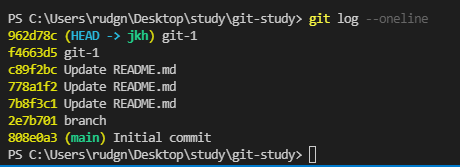

# git의 기본

## git이란?
- 분산형 관리 시스템 (linux 소스코드 관리 목적으로 개발)
- 소스 변경 이력을 쉽게 확인할 수 있고, 특정 시점에 저장된 버전과 비교하거나 특정 시점으로 되돌아갈 수도 있다.

## git 저장소
- 원격 저장소(Remote Repository) : 파일이 원격 저장소 전용 서버에서 관리되며 여러 사람이 함께 공유하기 위한 저장소
- 로컬 저장소(Local Repository) : 내 PC에 파일이 저장되는 개인 전용 저장소
- 로컬 저장소 -push-> 원격 저장소 -pull-> 로컬 저장소
- 저장소 만들기 2가지
    - 새로운 저장소 만들기
    - 이미 만들어져 있는 원격 저장소를 로컬 저장소로 복사

## git 커밋
- 변경 사항 저장 기능
- 이전 커밋 상태부터 현재 상태까지의 변경 이력이 기록된 커밋이 생성
- 시간순으로 저장
- 40가지 고유 이름으로 구분 및 선택
- 커밋 시, 커밋 메세지 필수!(변경 사유)
- git commit -m "메세지"

## git 작업 트리와 인덱스
- 작업 트리(Work Tree) : 다들 흔히 아는 "폴더"
- 인덱스(Index) : 커밋을 실행하기 전의 저장소와 작업 트리 사이에 존재하는 공간
- 커밋은 작업 트리에 있는 변경 내용을 저장소에 바로 기록하는 것이 아니라 그 사이 공간인 인덱스에 파일 상태를 기록(stage)하게 되어 있다. 따라서 저장소의 변경 사항을 기록하기 위해서는, 기록하고자 하는 모든 변경 사항들이 인덱스에 존재해야 한다.
- vs기준으로 보면 그  공유 아이콘에 있는 change 내용들이 index...?

## git 저장소 만들기
- 기존 디렉토리를 git 저장소로 활용
    1. 폴더 생성
    2. git init (.git파일 생성)
    3. 자료 추가
    4. git commit -m '이름'

- 레포지토리 clone 하기
    1. git clone '주소'
    2. 자료 추가
    3. git commit

## git push pull clone
- push : 로컬 저장소의 내용을 원격 저장소로 업로드 
$ git push <저장소명> <브랜치명>
- pull : 변경된 원격 저장소의 내용을 로컬 저장소로 적용
$ git pull <저장소명> <브랜치명>
- clone : 누군가 작업해놓은 이력을 통째로 복제해와서 PC에 적용 
$ git clone <주소>
- remote : 폴더를 저장소와 연결하거나 끊을 수 있음 
$ git remote add(or remove) <저장소명> <주소>

## 방금 겪은 일 - git 발전편 참고!
- commit을 잘못해서 취소 하고 싶었다
- git reset사용!
- git log --oneline 을 활용하여 현재 상태보기
- 돌아가길 원하는 곳으로 head를 이동시켜야함
- git reset <돌아가길 원하는 ID>
- 다시 git log --oneline으로 확인해보면 위에꺼 다사라짐  

## git을 통한 프로젝트 과정
- 저장소 만들기 -> 작업 -> commit -> push  
※ 만약 다른 저장소를 이용할 경우?  
- 저장소 불러오기(clone) -> 작업 -> commit -> push  
※ 변경된 프로젝트 불러오기  
- pull -> 작업 -> commit -> push  
- push를 하는 경우 기존의 프로젝트 내용과 병합(merge)가  이뤄진다.

## 충돌이 발생한 경우!
1. 원격 저장소와 로컬 저장소 양쪽에서 모두 수정한 경우
- 원칙적으로는 pull을 하여 원격과 로컬 모두 같은 상태를 만든 후 작업을 진행해야하지만 원격과 로컬이 모두 수정되어 작업이 겹쳐지는 경우 충돌이 발생한다.
- =============를 기준으로 윗 부분이 로컬, 아랫 부분이 원격이라 직접 수정후 commit해야한다.

 